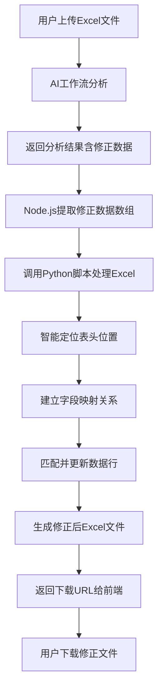
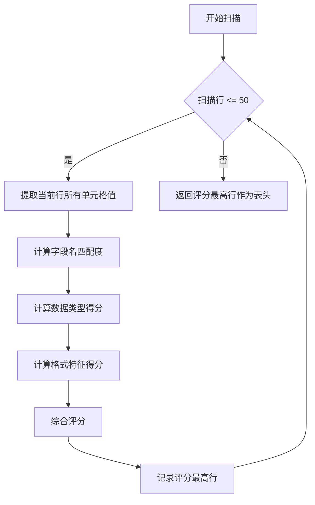
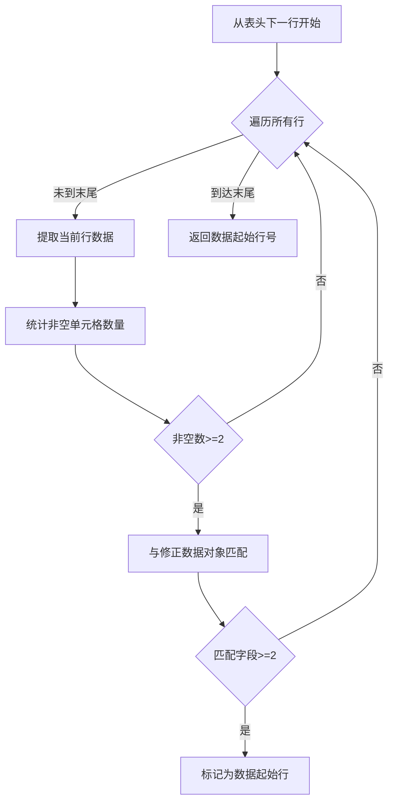
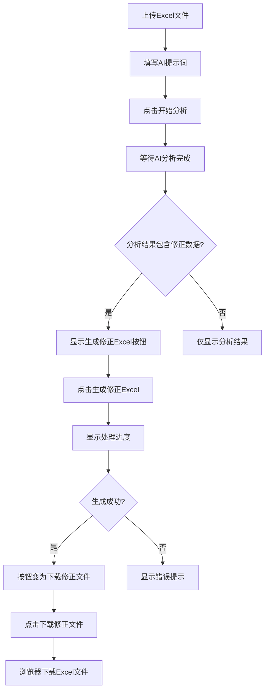
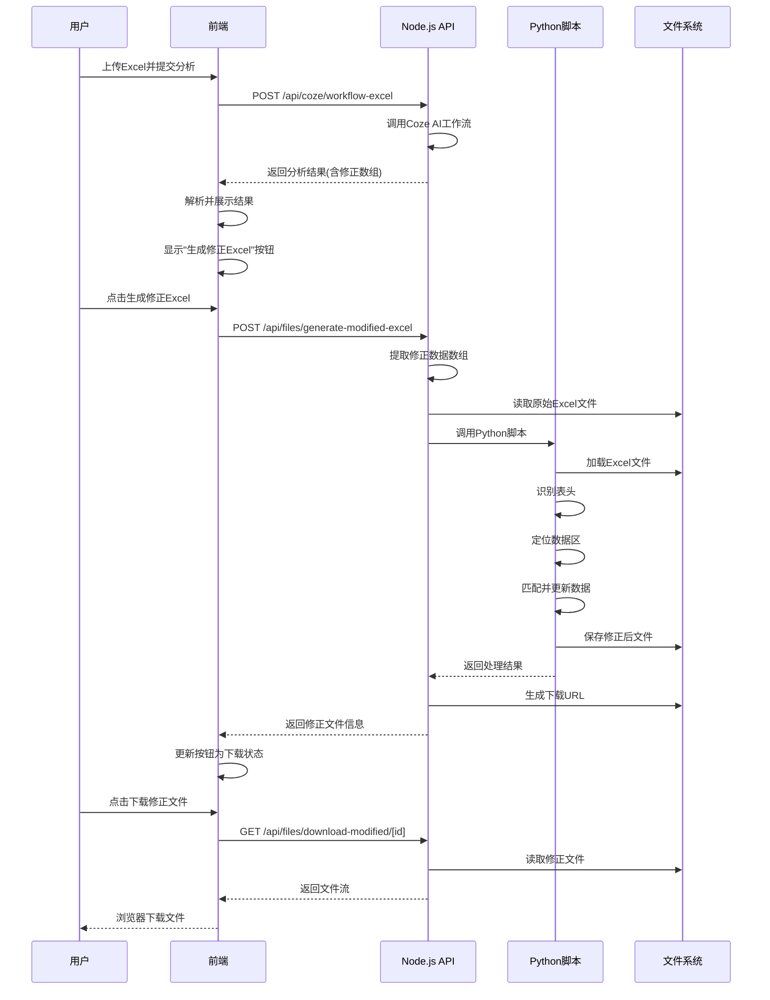

# Excel分析结果自动修正与导出设计文档

## 1. 需求概述

### 1.1 业务目标
在现有AI文档分析功能基础上，针对Excel文件分析场景，新增自动修正功能。系统需要根据AI分析返回的修正数据，自动生成一份修正后的Excel文件供用户下载。

### 1.2 核心功能
- 从AI分析结果中提取修正数据数组
- 智能匹配原Excel表格的表头与数据行
- 将修正后的数据回填到Excel文件中
- 生成带"(修改后)"后缀的新Excel文件供下载

### 1.3 技术约束
- 使用Python + openpyxl处理Excel文件操作
- Node.js后端负责数据提取和流程编排
- 表头位置不固定，需要智能识别
- 数据行起始位置不确定，需要通过锚点定位

## 2. 系统架构设计

### 2.1 整体流程



### 2.2 模块划分

#### 2.2.1 前端模块
- 显示"生成修正Excel"按钮（当分析结果包含修正数据时）
- 触发修正文件生成请求
- 下载修正后的Excel文件

#### 2.2.2 Node.js后端模块
- 解析AI分析结果，提取修正数据数组
- 验证修正数据格式有效性
- 调用Python脚本执行Excel修正
- 管理临时文件生成与清理
- 返回修正文件下载URL

#### 2.2.3 Python脚本模块
- 读取原始Excel文件
- 智能识别表头行位置
- 建立字段名与列索引的映射
- 智能定位数据起始行（锚点定位）
- 执行数据行的查找与替换
- 保存修正后的Excel文件

## 3. 核心功能设计

### 3.1 AI分析结果数据提取

#### 3.1.1 输入数据格式
AI分析结果可能包含多种格式的修正数据：

**格式1：纯JSON数组**
```
[
  {
    "序号": "1",
    "ERP识别码": "WGJ-DQ-CPCZ-0000",
    "品牌": "MITSUBISHI（三菱）",
    ...
  }
]
```

**格式2：嵌入在文本中的JSON**
```
前置描述文本...
[
  { 修正数据对象 }
]
后置说明文本...
```

**格式3：多个数组片段**
```
第一批修正：
[ 数组1 ]
第二批修正：
[ 数组2 ]
```

#### 3.1.2 数据提取策略

| 提取阶段 | 处理逻辑 | 输出 |
|---------|---------|------|
| 文本清理 | 移除Markdown标记、URL链接、特殊格式符号 | 纯文本内容 |
| JSON识别 | 使用正则表达式匹配所有JSON数组片段 | JSON数组列表 |
| 数据验证 | 检查每个对象是否包含必要字段（至少2个有效字段） | 有效数据对象列表 |
| 数组合并 | 将多个数组片段合并为单一数据集 | 统一修正数据集 |

#### 3.1.3 数据验证规则
- 每个修正对象必须包含至少2个非空字段
- 字段名需与Excel表头可能的名称匹配（允许模糊匹配）
- 至少包含一个唯一标识字段（序号、ERP识别码等）

### 3.2 Excel表头智能识别

#### 3.2.1 识别策略
由于表头位置不固定，需要采用多重策略进行识别：

**策略1：关键字密度检测**
- 扫描前50行（可配置）
- 统计每行包含已知字段名的数量
- 字段名包括：序号、ERP识别码、品牌、名称、型号、数量、单位、备注等
- 字段名密度最高的行视为表头行

**策略2：数据类型分析**
- 表头行通常包含较多文字，数据行包含混合类型
- 分析每行的单元格数据类型分布
- 文本类型占比高且非数字内容的行优先考虑

**策略3：格式特征识别**
- 检查单元格样式（加粗、背景色、字体大小）
- 合并单元格通常出现在标题区域
- 表头行往往有边框或特殊格式

#### 3.2.2 表头定位流程



#### 3.2.3 字段名映射表

| Excel可能的字段名 | 标准化字段名 | 别名列表 |
|------------------|-------------|---------|
| 序号 | index | 序号、编号、No、NO、#、项次 |
| ERP识别码 | erp_code | ERP识别码、识别码、编码、代码、ERP Code |
| 品牌 | brand | 品牌、厂商、制造商、Brand |
| 名称 | name | 名称、品名、产品名、Name |
| 型号尺寸 | model | 型号、规格、型号尺寸、Model、Spec |
| 数量 | quantity | 数量、Qty、QTY、数目 |
| 单位 | unit | 单位、Unit、计量单位 |
| 备注 | remark | 备注、说明、备注说明、Remark、Note |

### 3.3 数据行锚点定位

#### 3.3.1 锚点定位原理
由于数据行起始位置不固定，需要通过"锚点定位"方法找到第一行有效数据：

**锚点条件**
- 该行至少有2个及以上的列内容非空
- 内容与修正数据的某个对象至少有2个字段匹配
- 该行位于表头行之后

#### 3.3.2 定位算法流程



#### 3.3.3 匹配策略
- 优先使用唯一标识字段匹配（序号、ERP识别码）
- 次要使用组合字段匹配（名称+品牌、名称+型号）
- 支持模糊匹配（去除空格、忽略大小写）

### 3.4 数据更新与回填

#### 3.4.1 更新策略

**策略A：基于唯一标识的精确匹配**
1. 提取修正对象的唯一标识字段值（序号或ERP识别码）
2. 在Excel数据区域查找对应行
3. 更新该行的相关字段值

**策略B：基于组合字段的模糊匹配**
1. 当无唯一标识或标识匹配失败时
2. 使用多字段组合（名称+品牌+型号）进行匹配
3. 匹配度计算：相同字段数 / 总字段数
4. 选择匹配度最高且超过阈值（如70%）的行进行更新

#### 3.4.2 更新规则表

| 规则类型 | 条件 | 更新行为 | 备注 |
|---------|------|---------|------|
| 精确替换 | 字段值完全不同 | 直接覆盖原值 | 如品牌从"西门子"改为"三菱" |
| 补充填充 | 原字段为空 | 填入新值 | 补充缺失信息 |
| 格式修正 | 格式不规范 | 标准化后填入 | 如"0.75KW"修正为"0.75KW" |
| 保持原值 | 修正数据中字段为空 | 不更新 | 避免误删除 |

#### 3.4.3 更新日志记录
记录每次更新的详细信息，用于追溯和验证：

| 记录字段 | 说明 |
|---------|------|
| 行号 | Excel中的行号 |
| 匹配字段 | 用于定位该行的字段名和值 |
| 更新字段 | 发生变更的字段名列表 |
| 原值 | 更新前的值 |
| 新值 | 更新后的值 |
| 更新时间 | 修正操作时间戳 |

### 3.5 文件生成与管理

#### 3.5.1 文件命名规则
```
原文件名: 电气元件清单.xlsx
修正文件名: 电气元件清单(修改后).xlsx
```

命名处理逻辑：
- 提取原文件名（不含扩展名）
- 追加"(修改后)"后缀
- 保持原扩展名.xlsx

#### 3.5.2 文件存储策略

| 存储阶段 | 存储位置 | 生命周期 | 清理策略 |
|---------|---------|---------|---------|
| 原始上传文件 | uploads/ | 分析完成前 | 分析后立即清理或保留24小时 |
| 修正后文件 | uploads/modified/ | 下载后 | 保留24小时后自动清理 |
| 临时处理文件 | temp/ | 处理期间 | 处理完成立即删除 |

#### 3.5.3 下载URL生成
```
下载URL格式: /api/files/download-modified/[fileId]
有效期: 24小时
访问控制: 无需认证（临时链接）
```

## 4. 接口设计

### 4.1 生成修正Excel接口

#### 4.1.1 请求规范

**端点**
```
POST /api/files/generate-modified-excel
```

**请求体参数表**

| 参数名 | 类型 | 必填 | 说明 | 示例 |
|-------|------|------|------|------|
| fileId | String | 是 | 原始Excel文件ID | "abc123xyz" |
| analysisResult | Object | 是 | AI分析结果对象 | { content: "..." } |
| originalFileName | String | 是 | 原始文件名 | "电气元件清单.xlsx" |

**请求示例**
```
{
  "fileId": "file_abc123",
  "analysisResult": {
    "content": "[{\"序号\":\"1\",\"品牌\":\"三菱\",...}]"
  },
  "originalFileName": "电气元件清单.xlsx"
}
```

#### 4.1.2 响应规范

**成功响应**

| 字段名 | 类型 | 说明 |
|-------|------|------|
| success | Boolean | 操作成功标识 |
| modifiedFileId | String | 修正文件ID |
| fileName | String | 修正文件名 |
| downloadUrl | String | 下载URL |
| modificationCount | Number | 修正条目数量 |
| updateLog | Array | 更新日志 |

**响应示例**
```
{
  "success": true,
  "modifiedFileId": "modified_xyz789",
  "fileName": "电气元件清单(修改后).xlsx",
  "downloadUrl": "/api/files/download-modified/modified_xyz789",
  "modificationCount": 3,
  "updateLog": [
    {
      "row": 5,
      "field": "品牌",
      "oldValue": "SIEMENS(西门子)",
      "newValue": "MITSUBISHI(三菱)"
    }
  ]
}
```

**错误响应**

| 错误码 | HTTP状态码 | 说明 |
|-------|-----------|------|
| INVALID_FILE | 400 | 文件不存在或格式错误 |
| NO_MODIFICATION_DATA | 400 | 分析结果中无修正数据 |
| HEADER_NOT_FOUND | 400 | 无法识别Excel表头 |
| PROCESS_FAILED | 500 | Python脚本执行失败 |

### 4.2 下载修正文件接口

**端点**
```
GET /api/files/download-modified/[fileId]
```

**响应**
- Content-Type: application/vnd.openxmlformats-officedocument.spreadsheetml.sheet
- Content-Disposition: attachment; filename="原文件名(修改后).xlsx"
- 文件二进制流

## 5. Python脚本设计

### 5.1 脚本输入输出

#### 5.1.1 命令行参数表

| 参数名 | 类型 | 必填 | 说明 |
|-------|------|------|------|
| --input-file | String | 是 | 原始Excel文件路径 |
| --output-file | String | 是 | 输出Excel文件路径 |
| --modification-data | String | 是 | JSON格式的修正数据 |
| --log-file | String | 否 | 更新日志输出路径 |

#### 5.1.2 输出格式

**标准输出（JSON）**
```
{
  "success": true,
  "processedRows": 3,
  "updatedCells": 8,
  "skippedRows": 0,
  "errors": [],
  "logFile": "/path/to/update_log.json"
}
```

**错误输出**
```
{
  "success": false,
  "error": "错误类型",
  "message": "详细错误信息",
  "traceback": "Python异常堆栈"
}
```

### 5.2 核心处理逻辑

#### 5.2.1 主流程模块划分

| 模块名 | 职责 | 输入 | 输出 |
|-------|------|------|------|
| FileLoader | 加载Excel文件 | 文件路径 | Workbook对象 |
| HeaderDetector | 表头识别 | Worksheet对象 | 表头行号、字段映射表 |
| DataLocator | 数据区定位 | Worksheet、表头信息 | 数据起始行号 |
| RowMatcher | 行匹配器 | 修正对象、数据区 | 目标行号 |
| CellUpdater | 单元格更新 | 行号、字段名、新值 | 更新结果 |
| FileSaver | 保存文件 | Workbook对象、输出路径 | 保存状态 |

#### 5.2.2 关键算法伪代码

**表头识别算法**
```
function detectHeader(worksheet):
  maxScore = 0
  headerRow = null
  knownFields = ["序号", "ERP识别码", "品牌", ...]
  
  for row in worksheet.rows[0:50]:
    score = 0
    for cell in row:
      if cell.value in knownFields or fuzzyMatch(cell.value, knownFields):
        score += 1
    
    if score > maxScore:
      maxScore = score
      headerRow = row.row_number
  
  return headerRow
```

**行匹配算法**
```
function matchRow(modificationObject, dataRange, fieldMapping):
  // 策略1: 唯一标识匹配
  if "序号" in modificationObject:
    targetRow = findByValue(dataRange, fieldMapping["序号"], modificationObject["序号"])
    if targetRow:
      return targetRow
  
  // 策略2: 组合字段匹配
  bestMatch = null
  bestScore = 0
  
  for row in dataRange:
    score = calculateMatchScore(row, modificationObject, fieldMapping)
    if score > bestScore and score >= 0.7:
      bestScore = score
      bestMatch = row
  
  return bestMatch
```

### 5.3 依赖库与版本

| 库名 | 版本要求 | 用途 |
|------|---------|------|
| openpyxl | >= 3.0.0 | Excel文件读写 |
| fuzzywuzzy | >= 0.18.0 | 字符串模糊匹配 |
| python-Levenshtein | >= 0.12.0 | 加速模糊匹配 |

## 6. 前端交互设计

### 6.1 UI组件设计

#### 6.1.1 修正按钮显示条件
- AI分析完成
- 分析结果包含有效的修正数据数组
- 原文件为Excel格式（.xlsx或.xls）

#### 6.1.2 按钮状态表

| 状态 | 显示文本 | 图标 | 可点击 | 样式 |
|------|---------|------|--------|------|
| 空闲 | 生成修正Excel | 下载图标 | 是 | 主题色按钮 |
| 处理中 | 生成中... | 旋转加载图标 | 否 | 禁用状态 |
| 成功 | 下载修正文件 | 成功图标 | 是 | 成功色按钮 |
| 失败 | 生成失败 | 错误图标 | 是 | 错误色按钮 |

#### 6.1.3 修正统计信息展示

在分析结果面板中新增"修正信息"卡片：

| 展示项 | 说明 |
|-------|------|
| 修正条目数 | 共修正X条数据 |
| 更新字段统计 | 品牌(3)、型号(2)、备注(1) |
| 预览前3条修正 | 列表展示主要修正内容 |
| 查看完整日志 | 可展开查看所有修正详情 |

### 6.2 用户操作流程



### 6.3 错误处理与提示

| 错误场景 | 提示信息 | 用户操作建议 |
|---------|---------|-------------|
| 原文件不存在 | 原始文件已失效，请重新上传 | 重新上传文件并分析 |
| 无修正数据 | 分析结果中未包含可修正的数据 | 检查AI提示词是否正确 |
| 表头识别失败 | 无法识别Excel表头结构 | 确保Excel格式标准 |
| 修正数据格式错误 | 修正数据格式不正确 | 联系技术支持 |
| 处理超时 | 文件处理超时，请稍后重试 | 稍后重试或检查文件大小 |

## 7. 数据流转设计

### 7.1 完整数据流图



### 7.2 数据转换节点

| 节点 | 输入格式 | 输出格式 | 转换逻辑 |
|------|---------|---------|---------|
| AI结果解析 | Coze响应对象 | 纯文本内容 | 提取content字段 |
| 修正数据提取 | 纯文本 | JSON数组 | 正则匹配、JSON解析 |
| 数据验证 | JSON数组 | 有效对象列表 | 字段检查、去重 |
| Python参数构建 | JSON对象 | 命令行参数 | 序列化为字符串 |
| 处理结果解析 | Python stdout | JSON对象 | JSON解析 |

## 8. 异常处理与容错

### 8.1 异常分类与处理策略

| 异常类型 | 触发条件 | 处理策略 | 用户反馈 |
|---------|---------|---------|---------|
| 文件读取失败 | 文件损坏或权限不足 | 记录日志，返回错误 | 文件无法读取 |
| 表头识别失败 | 表格格式异常 | 尝试降级策略（首行作为表头） | 建议检查文件格式 |
| 数据匹配失败 | 修正数据与原表无对应 | 跳过该条，继续处理其他 | 部分数据未匹配成功 |
| Python脚本异常 | 脚本执行错误 | 捕获异常，返回详细信息 | 处理失败，请重试 |
| 文件保存失败 | 磁盘空间不足 | 清理临时文件，重试一次 | 保存失败，请联系管理员 |

### 8.2 降级处理方案

#### 8.2.1 表头识别降级
- 主策略失败 → 使用首行作为表头
- 首行无效 → 使用前10行中文本最多的行
- 仍失败 → 要求用户提供表头行号

#### 8.2.2 行匹配降级
- 唯一ID匹配失败 → 使用组合字段匹配
- 组合匹配失败 → 使用序号顺序匹配
- 仍失败 → 跳过该条修正记录

### 8.3 重试机制

| 操作 | 重试次数 | 重试间隔 | 触发条件 |
|------|---------|---------|---------|
| Python脚本调用 | 2次 | 1秒 | 进程异常退出 |
| 文件保存 | 1次 | 2秒 | IO错误 |
| 不重试场景 | - | - | 数据格式错误、逻辑错误 |

## 9. 性能优化策略

### 9.1 处理性能指标

| 指标 | 目标值 | 测量场景 |
|------|-------|---------|
| 小文件处理时间 | < 3秒 | 100行以内 |
| 中文件处理时间 | < 10秒 | 1000行以内 |
| 大文件处理时间 | < 30秒 | 5000行以内 |
| 内存占用 | < 100MB | 任意文件大小 |

### 9.2 优化措施

#### 9.2.1 数据处理优化
- 使用openpyxl的read_only模式读取大文件（仅读取时）
- 使用write_only模式写入大文件（减少内存占用）
- 批量更新单元格，减少文件保存次数
- 提前终止扫描（找到表头后立即停止）

#### 9.2.2 并发控制
- 同一用户限制最多同时处理2个修正任务
- 使用队列机制排队处理，避免资源耗尽
- 超时时间设置为60秒，超时自动取消

#### 9.2.3 缓存策略
- 缓存表头识别结果（同一文件短期内重复处理）
- 缓存字段映射表（减少重复计算）

## 10. 测试验证方案

### 10.1 测试用例设计

| 用例编号 | 测试场景 | 测试数据 | 预期结果 |
|---------|---------|---------|---------|
| TC-01 | 标准表头，序号从1开始 | 标准格式Excel | 成功识别表头并修正 |
| TC-02 | 表头在第5行 | 前4行为标题信息 | 正确定位第5行为表头 |
| TC-03 | 序号从3开始 | 数据行从序号3开始 | 正确定位数据起始行 |
| TC-04 | 无序号列 | 仅包含名称、品牌等字段 | 使用组合匹配成功更新 |
| TC-05 | 多个修正数组 | AI结果包含2个JSON数组 | 合并后全部应用 |
| TC-06 | 部分数据无匹配 | 修正数据中有不存在的序号 | 跳过无匹配项，其他正常 |
| TC-07 | 空字段修正 | 修正对象某些字段为空 | 保持原值不变 |
| TC-08 | 中文字段名 | 全中文表头 | 正确映射并更新 |
| TC-09 | 大文件 | 5000行数据 | 30秒内完成 |
| TC-10 | 异常格式文件 | .xls格式 | 转换为.xlsx后处理 |

### 10.2 验证检查点

#### 10.2.1 功能验证
- [ ] 修正数据提取完整性
- [ ] 表头识别准确性
- [ ] 数据行匹配正确性
- [ ] 单元格更新准确性
- [ ] 文件命名规范性
- [ ] 下载功能可用性

#### 10.2.2 边界验证
- [ ] 空Excel文件处理
- [ ] 仅有表头无数据
- [ ] 修正数据为空数组
- [ ] 超大文件（10000行）
- [ ] 特殊字符处理

#### 10.2.3 异常验证
- [ ] 文件不存在时的错误提示
- [ ] 格式错误文件的降级处理
- [ ] Python脚本异常的捕获
- [ ] 磁盘空间不足的处理

## 11. 部署与配置

### 11.1 环境依赖

| 依赖项 | 版本要求 | 用途 |
|-------|---------|------|
| Node.js | >= 18.0.0 | 运行时环境 |
| Python | >= 3.8 | 脚本执行环境 |
| pip | 最新版 | Python包管理 |

### 11.2 配置项说明

#### 11.2.1 Node.js配置

```
配置文件: .env 或 nuxt.config.ts

配置项:
- PYTHON_PATH: Python可执行文件路径（默认：python3）
- EXCEL_SCRIPT_PATH: Python脚本路径（默认：./scripts/modify_excel.py）
- MODIFIED_FILES_DIR: 修正文件存储目录（默认：./uploads/modified）
- FILE_RETENTION_HOURS: 文件保留时长（默认：24）
- MAX_CONCURRENT_TASKS: 最大并发任务数（默认：2）
```

#### 11.2.2 Python脚本配置

```
配置文件: scripts/config.py 或命令行参数

配置项:
- HEADER_SCAN_LIMIT: 表头扫描行数上限（默认：50）
- MATCH_THRESHOLD: 模糊匹配阈值（默认：0.7）
- FIELD_ALIASES: 字段别名映射表
- LOG_LEVEL: 日志级别（默认：INFO）
```

### 11.3 安装步骤

#### 步骤1：安装Python依赖
```
命令: pip install -r requirements.txt

验证: python -c "import openpyxl; print(openpyxl.__version__)"
```

#### 步骤2：创建脚本文件
```
路径: server/api/files/modify_excel.py
      scripts/modify_excel.py（备选）

权限: chmod +x modify_excel.py
```

#### 步骤3：创建存储目录
```
目录结构:
uploads/
  ├── original/     # 原始上传文件
  ├── modified/     # 修正后文件
  └── temp/         # 临时文件

命令: mkdir -p uploads/{original,modified,temp}
```

#### 步骤4：配置环境变量
```
添加到 .env:
PYTHON_PATH=/usr/bin/python3
EXCEL_SCRIPT_PATH=./server/api/files/modify_excel.py
```

## 12. 监控与日志

### 12.1 日志记录策略

| 日志级别 | 记录内容 | 示例 |
|---------|---------|------|
| INFO | 正常处理流程节点 | Excel修正开始、完成 |
| WARN | 降级处理、部分失败 | 使用降级策略识别表头 |
| ERROR | 异常错误 | Python脚本执行失败 |
| DEBUG | 详细调试信息 | 表头识别得分详情 |

### 12.2 关键指标监控

| 指标名 | 说明 | 告警阈值 |
|-------|------|---------|
| 修正成功率 | 成功/总请求数 | < 90% |
| 平均处理时间 | 平均耗时 | > 15秒 |
| Python脚本失败率 | 脚本异常次数/总次数 | > 5% |
| 文件清理延迟 | 文件保留超期数量 | > 100个 |

### 12.3 操作审计

记录所有修正操作的审计日志：

| 审计字段 | 说明 |
|---------|------|
| 用户标识 | 操作用户（如有认证） |
| 原文件名 | 原始Excel文件名 |
| 修正时间 | 操作时间戳 |
| 修正条目数 | 实际更新的数据条数 |
| 处理耗时 | 总处理时间 |
| 状态 | 成功/失败 |

## 13. 安全考虑

### 13.1 文件安全

| 安全措施 | 实施方式 |
|---------|---------|
| 文件类型验证 | 仅允许.xlsx、.xls格式 |
| 文件大小限制 | 最大10MB |
| 病毒扫描 | 集成ClamAV或第三方扫描API（可选） |
| 路径遍历防护 | 验证文件ID，禁止包含../等路径符号 |

### 13.2 数据安全

| 安全措施 | 实施方式 |
|---------|---------|
| 敏感信息脱敏 | 日志中不记录完整单元格内容 |
| 文件加密存储 | 对存储的Excel文件进行加密（可选） |
| 临时文件清理 | 处理完成立即删除temp目录文件 |
| 下载链接过期 | 24小时后失效 |

### 13.3 注入防护

| 威胁 | 防护措施 |
|------|---------|
| 命令注入 | 使用subprocess参数化调用，不使用shell=True |
| Excel公式注入 | 对单元格内容进行转义，禁止=开头的内容 |
| JSON注入 | 使用安全的JSON解析库 |

## 14. 扩展性设计

### 14.1 未来扩展方向

#### 14.1.1 多格式支持
- 支持.csv格式的修正
- 支持.ods（LibreOffice）格式
- 支持Google Sheets在线修正

#### 14.1.2 批量处理
- 一次上传多个Excel文件
- 批量应用相同的修正规则
- 合并多个修正结果为单个文件

#### 14.1.3 可视化对比
- 修正前后的数据对比视图
- 高亮显示变更的单元格
- 支持用户手动调整修正结果

#### 14.1.4 模板化配置
- 保存表头映射配置为模板
- 针对特定业务场景快速应用模板
- 模板共享与管理

### 14.2 接口扩展预留

预留接口参数字段：

| 字段名 | 用途 | 当前状态 |
|-------|------|---------|
| templateId | 应用预设模板 | 预留 |
| compareMode | 启用对比模式 | 预留 |
| userReview | 需要用户确认 | 预留 |
| customMapping | 自定义字段映射 | 预留 |

## 15. 关键实现文件规划

### 15.1 文件结构

```
项目根目录/
├── server/
│   ├── api/
│   │   ├── files/
│   │   │   ├── generate-modified-excel.post.ts    # 生成修正Excel接口
│   │   │   ├── download-modified/
│   │   │   │   └── [id].get.ts                    # 下载修正文件接口
│   │   │   └── modify_excel.py                    # Python处理脚本
│   ├── utils/
│   │   ├── excelModificationExtractor.ts          # 修正数据提取工具
│   │   └── pythonRunner.ts                        # Python脚本调用工具
├── scripts/
│   └── modify_excel.py                            # Python脚本（备选位置）
├── pages/
│   └── main/
│       └── document-analysis.vue                  # 前端页面（已存在，需修改）
└── requirements.txt                               # Python依赖（需更新）
```

### 15.2 核心模块职责

| 文件路径 | 模块职责 | 主要函数 |
|---------|---------|---------|
| generate-modified-excel.post.ts | 接收请求、编排流程 | handler() |
| excelModificationExtractor.ts | 提取修正数据 | extractModificationData() |
| pythonRunner.ts | 调用Python脚本 | runPythonScript() |
| modify_excel.py | Excel文件处理 | main(), detect_header(), match_row(), update_cell() |
| document-analysis.vue | 前端交互 | generateModifiedExcel(), downloadModifiedFile() |

## 16. 技术风险与应对

### 16.1 风险识别

| 风险项 | 风险等级 | 影响 | 概率 |
|-------|---------|------|------|
| Python环境缺失 | 高 | 功能完全不可用 | 中 |
| openpyxl兼容性问题 | 中 | 部分文件无法处理 | 低 |
| 表头识别准确率低 | 中 | 用户体验差 | 中 |
| 大文件处理超时 | 中 | 功能失败 | 中 |
| 并发冲突 | 低 | 数据错乱 | 低 |

### 16.2 应对措施

| 风险项 | 应对措施 |
|-------|---------|
| Python环境缺失 | 部署时检测Python环境，提供安装指引；提供Docker镜像 |
| openpyxl兼容性 | 降级使用pandas+xlrd/xlwt；提供格式转换提示 |
| 表头识别准确率低 | 提供手动指定表头行的选项；优化识别算法 |
| 大文件处理超时 | 增加超时时间；使用异步任务队列 |
| 并发冲突 | 使用文件锁；限制并发数 |

## 17. 与现有系统集成

### 17.1 集成点分析

| 集成点 | 现有功能 | 新增功能 | 修改方式 |
|-------|---------|---------|---------|
| document-analysis.vue | AI分析结果展示 | 新增修正Excel按钮 | 新增Vue组件和方法 |
| /api/coze/workflow-excel | Excel AI分析 | 无需修改 | 无 |
| 文件上传存储 | 原始文件保存 | 新增modified目录 | 扩展存储逻辑 |
| 文件清理定时任务 | 清理上传文件 | 清理修正文件 | 扩展清理范围 |

### 17.2 兼容性保证

- 不影响现有Word文档分析功能
- 不影响现有Excel分析功能
- 新增功能仅在特定条件下触发（分析结果包含修正数据时）
- 向后兼容：即使修正功能失败，原分析结果仍可正常展示

### 17.3 数据共享

- 复用现有文件上传的fileId
- 复用现有的analysisResult数据结构
- 复用现有的文件清理策略

## 18. 开发优先级与里程碑

### 18.1 开发阶段划分

| 阶段 | 交付物 | 验收标准 |
|------|-------|---------|
| 阶段1：核心逻辑 | Python脚本基础版本 | 能处理标准格式Excel并成功修正 |
| 阶段2：接口开发 | Node.js API接口 | 接口调通，返回正确结果 |
| 阶段3：前端集成 | 前端交互完整 | 用户可完整操作并下载文件 |
| 阶段4：优化增强 | 异常处理、性能优化 | 通过所有测试用例 |
| 阶段5：部署上线 | 生产环境部署 | 稳定运行，日志完善 |

### 18.2 功能优先级

| 优先级 | 功能点 | 理由 |
|-------|-------|------|
| P0（必须） | 基础修正功能 | 核心价值 |
| P0（必须） | 标准表头识别 | 绝大多数场景 |
| P0（必须） | 序号匹配 | 最常用匹配方式 |
| P1（重要） | 降级策略 | 提高成功率 |
| P1（重要） | 错误提示 | 用户体验 |
| P2（优化） | 更新日志 | 可追溯性 |
| P3（未来） | 可视化对比 | 增强功能 |

## 19. 成功指标

### 19.1 功能指标

| 指标名 | 目标值 | 衡量方式 |
|-------|-------|---------|
| 功能可用性 | > 95% | 成功请求数/总请求数 |
| 表头识别准确率 | > 85% | 正确识别数/总文件数 |
| 数据匹配准确率 | > 90% | 正确匹配行数/总修正条数 |
| 单元格更新准确率 | 100% | 正确更新/总更新数 |

### 19.2 性能指标

| 指标名 | 目标值 |
|-------|-------|
| 中小文件平均处理时间 | < 5秒 |
| 大文件平均处理时间 | < 20秒 |
| 并发处理能力 | 2个/服务器 |

### 19.3 用户体验指标

| 指标名 | 目标值 | 衡量方式 |
|-------|-------|---------|
| 用户操作步骤 | ≤ 3步 | 从分析完成到下载完成 |
| 错误提示清晰度 | 主观评估良好 | 用户反馈 |
| 功能使用率 | > 60% | 使用修正功能的用户/总Excel分析用户 |
